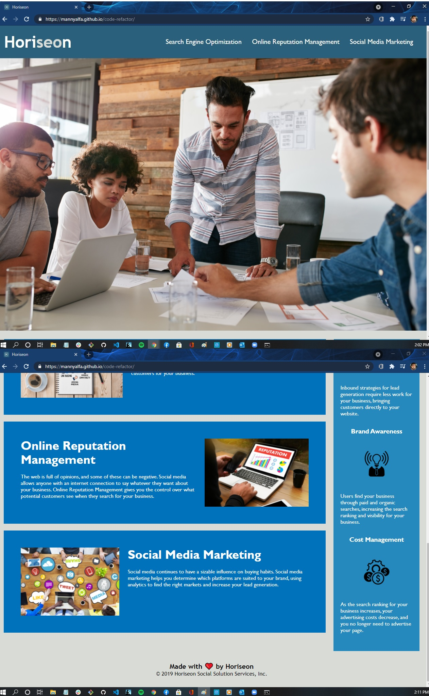

## Challege  Code Refactor

#Webpage name: Horiseon

#Synopsis of content: Horiseon offers ways to enhance an organization's online presence.
Page utilizes in-page links.

Challenge Task: Refactor the existing webpage to make it accessible and ensure functionality.

Deployed Website image:

 
Summary of Changes:

Added favicon

changed title to "Horiseon" for search accessability

Removed uneccesary div class in header, simply changed element to header

Made corresponding changes in CSS to maintain format & style

Changed div to nav to define in-page links

Made corresponding changes in CSS to maintain format & style

NOTE: I considered changing the backround photo in "hero" in CSS to an img HTML element, but kept it as-is: in a real-world situation i would 
inquire as to any anticipated features, to add later if none, THEN I would change as previously mentioned.

Changed 'div class="content"' to "section" and "div" to "article" as well as relevant CSS code.

Changed "div class" in 'search engine optimization' to "article id" to make corresponding <a> tag in nav section functional.

Changed individual classes to 'features' since they all shared the same CSS styling, coded CSS accordingly, removing two redundant 
items as well as changing child styling accordingly to maintain parent-child styling Changed side-panel div to 'aside' and consolidated
benefit-lead, benefit-brand and benefit-cost to one class: "benefit"

**I left the remaining child elements within the <aside> as 
 items, since they were removed from all other page elements and that they 
are no longer being overused here.

Added alt tags to images 

changed 'div class="footer"' to footer 

Changed <h2> to <h4>

THIS IS A RESUBMISSION FROM 4/28, PREVIOUS GRADE 85/100

